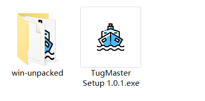

# “港骥之拖”软件系统使用说明

## 项目目录说明


`Backend`目录下是计算服务端工程源码
`Frontend`目录下是前端工程源码
`Release`目录下是项目构建发布的内容，是最终交付给用户的产品，注意不要误将其他目录下的源文件发布出去
`doc`项目相关文档

## 构建发布与运行

### 发布

#### 环境依赖

请确保本机已安装`Node.js`环境（本系统开发时采用`Node.js 14`），可在[Node.js 官网](https://nodejs.org/zh-cn/) 下载安装

#### 构建发布版产品

双击项目目录下的`Build.bat`文件，将自动构建前后端的发布版产品，输出到`Release`目录中。

#### 发布计算服务

将`Release/Backend`目录压缩打包后可作为服务端产品发布

#### 发布前端

在`Release/Frontend/Standard`目录下，有一个名为`TugMaster Setup.exe`的安装包，和一个名为`win- unpacked`的目录，二者都可以作为最终产品发布（后者以压缩包形式发布），区别在于前者执行安装后使用，后者是解压后即可使用，可根据需要选择。



### 运行

#### 计算服务端

在计算服务的发布目录下，双击`启动计算服务.bat`文件


等待弹出的命令行窗口中输出

```
初始化完成，服务运行中...
```

则说明计算服务已正常运行，可启动前端计算

#### 前端

若采用安装包形式发布，则先双击运行安装包，根据提示安装到系统某路径下，安装程序会在桌面和启动栏添加应用的快捷方式（和安装包的图标一样），双击此快捷方式即可打开前端软件；若采用免安装压缩包形式发布，则解压后在目录下双击运行`TugMaster.exe`文件，也可打开前端软件，为了使用方便，可在此文件上右键发送快捷方式到桌面，创建对应的快捷方式。

## 软件操作

### 计算服务端

计算服务目前只需要按上节的指导运行即可，无需额外的操作。

### 前端

#### 启动航速优化任务

1. **输入规划航线**

   在航速优化页面最下方的文本框中输入规划航线的经纬度坐标序列，坐标按航线起点到终点的顺序排列，每组坐标的**纬度在前、经度在后**，可使用任意符号分隔这些数字（`-`与`+`除外，它们会作为数字的一部分解析），例如：

   ```
   30.66424，123.122.11958 ；30.66424，122.31958 ；30.86424，122.56958
   ```

   ```
   (30.66424，122.11958 ）,（30.66424，122.31958）,（30.86424，122.56958）
   ```
   ```
   30.66424N，122.11958E
   30.66424N，122.31958E
   30.86424N，122.56958E
   ```

   这些都是格式正确的坐标序列，因此输入是很灵活宽松的，用户只要仔细检查坐标本身的正确性即可。

2. **启动计算**

   点击文本框右边的启动优化按钮，文本框中设定的规划航线会更新到地图上（红色实线），同时前端开始周期性请求计算服务对当前模型（包括设定的航线和船舶状态等参数）做优化求解，计算返回的推荐航速会显示在地图上方，短时预测轨迹在地图中用深色虚线绘制（在船舶标记附近）。任何时候都可以点击停止按钮来终止前端的优化计算任务。

3. **地图及相关操作**

   地图中包含了航速优化计算的全部结果。在地图顶部会同步显示推荐航速、当前航速和当前位置，这是给船舶驾驶员最重要的参考信息

   

   在地图左下方有一个开启跟踪选项控件，勾选上则地图将始终以船舶位置为中心点，即实现船舶的跟踪显示，这时无法任意改变地图视口；在地图右上部分是绘图工具栏，用户可以点击这些图形按钮在地图上即时绘制相应的几何图形，其操作方法和所有的绘图软件一致，在此略去说明；在地图右下方有全屏按钮，点击它可以让地图全屏显示，这有助于驾驶员更好的应用本工具做优化航行操作，在全屏时再次点击此按钮或按ESC键即可退回到初始界面；在全屏按钮的下方有一个面板，它实时显示鼠标当前位置对应的经纬度，以便操作员快速在图中获取位置坐标。

4. **停止计算和退出软件**

   任何时候都可以点击`停止`按钮来终止前端的优化计算任务，也可以随时关闭或重启前端或计算服务软件，我们为此设计了诸多容错方案（能自动处理恢复的则继续运行，否则会弹出提示信息，指导操作人员检查和恢复系统），以增强整个系统的稳健性和可再入性，即保证安装了本系统的船舶任何时候都可快速接入优化计算任务，而不用在模型参数以外做特异性配置和操作。


