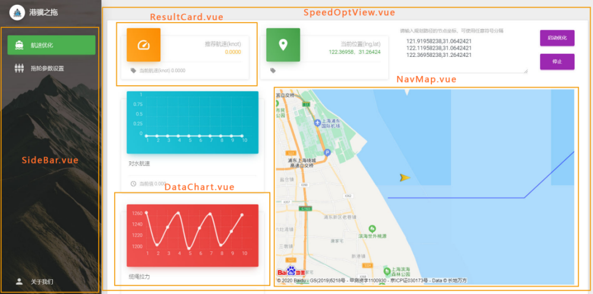
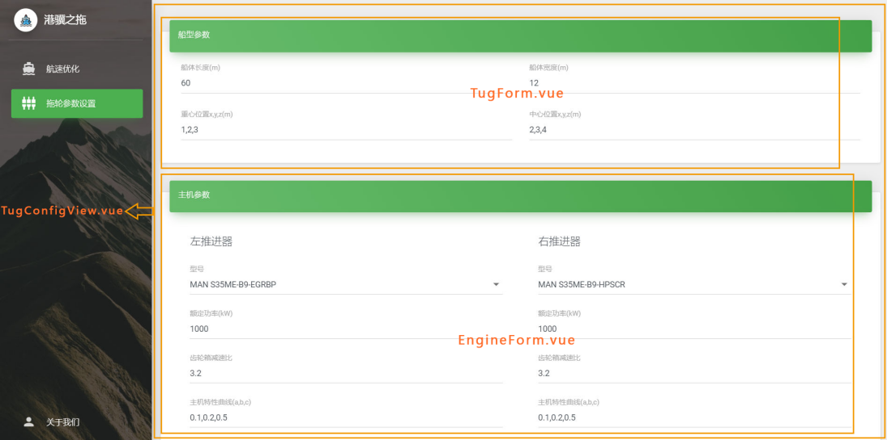
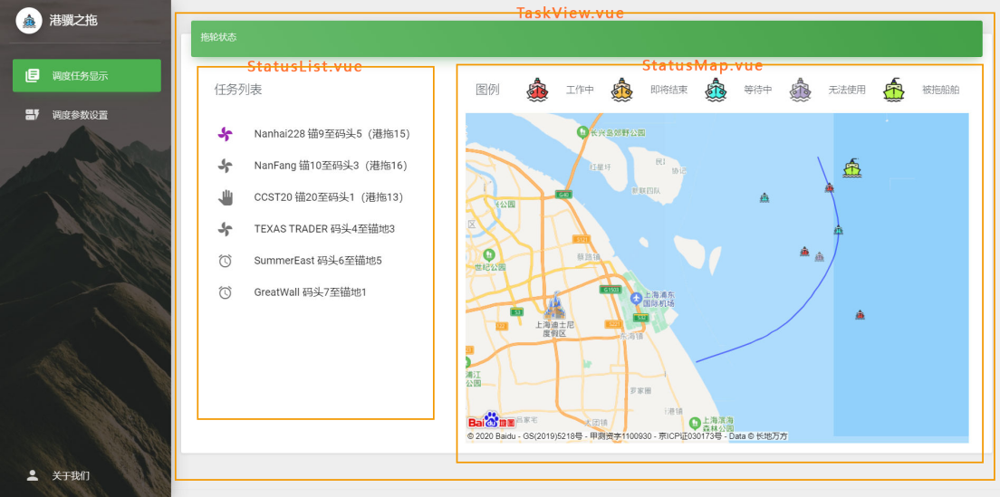
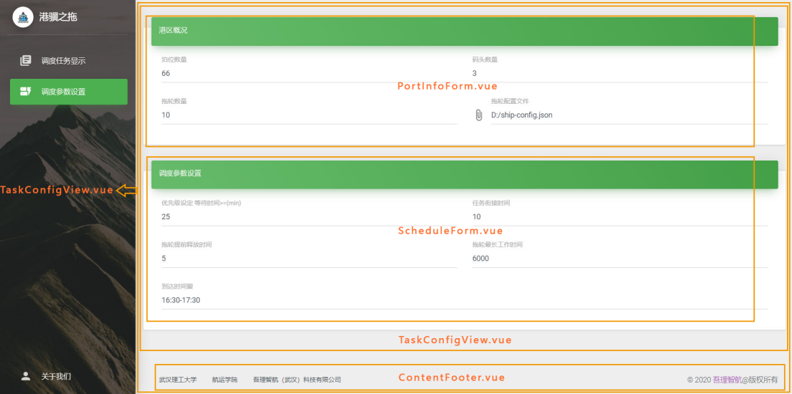

# **“港骥之拖”软件系统开发文档**

本文档旨在为后续二次开发提供技术指导，因此将以第一开发者视角，侧重介绍系统结构与技术组成，并对关键模块与代码进行释义，以方便二次开发者快速入手。

## 目录

[TOC]

## **一、系统结构**


本系统采用`B/S`架构，将数据、计算和视图充分解耦，前端通过Web接口访问后端提供的数据与计算服务。下面简述已完整实现的航速优化模块的工作流程：

在首次计算前，前端将请求计算服务端注册一个新的计算实例，服务端返回此实例相应的ID值（与它绑定的对象将储存此算例相关的参数），后续计算请求都会附上此ID参数，这种设计可以让计算后端同时服务多个前端的多个优化任务，同时将算例参数缓存在服务端，可以大幅减少优化计算过程中的通信量。在随后的每个计算周期里，前端首先从数据服务端请求传感器采样数据（包括位置与航速信息等），经过预处理后得到船舶当前状态参数，然后以此请求计算服务端的相关接口，服务端按预定算法解算后返回优化结果，最后前端更新相关视图。当用户修改了规划路径或其他船舶参数后，前端会调用计算服务端的相关接口修改本计算实例相应的参数，由于我们的计算接口是无状态的纯函数，因此可随时变更模型参数，无需作其他修改便可以再次请求计算接口完成对新模型的优化计算。

在本文档编写时，系统仅使用模拟数据对优化计算和前端交互模块做了功能验证，传感器数据对接工作尚未进行，数据后端在未来除了以HTTP协议和前端通信外，也可以直接使用`socket`通信或从`IO`接口访问连接在本机的传感器（前端页面嵌入`Electron`运行时，将使用`Node.js`环境，可以进行更多系统底层操作）。

参数设置与任务调度等模块是甲方委托我们预设计、留至后续再开发的，我们已经实现了相关前端页面，并充分考虑了后续开发时可能涉及的数据交互和传递等，在后文中对这部分作了较详细的介绍，给出了具体的设计和开发指导。

## **二、技术构成**

### **1、前端**

为了同时兼顾开发效率、界面美观性、可扩展性和跨平台等指标，选择使用Web技术来实现系统前端，并采用了当下Web工程较为先进的技术框架和设计理念，如使用最新的`H5+ES6`协议编码，页面模块化（基于`Vue`的组件技术，通过一系列结构化与自动化技术，可减少重复的HTML与js编码，极大提高了开发效率），单页面应用（`SPA`，减少前后端在视图上的冗余通信，也即最大化实现前后端解耦），`Electron+node.js`（基于`chromium`内核、`nodejs-v8`引擎的桌面应用开发框架，相当于一个本地化功能增强的专用浏览器，这使得我们的Web前端程序可以访问更多系统资源，同时可以打包成一个独立的桌面应用）。

在我们交付的工程目录中已经预安装了相关工具和依赖库等，在进入开发前，您只需要前往node.js官网下载安装Node环境即可。

#### **1.1** **工程管理与运行**

整个前端工程采用了当下流行的`Node npm`来管理（Node前端工程化，简单来说是按照`Node npm`所约定的包/模块管理或开发规范来组织工程），本系统的前端工程根目录结构如下：


根目录下的`package.json`是工程配置文件，包括了工程相关信息的描述、集成一些常用的命令行、声明本工程所依赖的一些第三方Node包/模块等，关于此文件的详细说明请百度或参考如下链接：

> [package.json | npm 安装文档 ](http://caibaojian.com/npm/files/package.json.html)
> 
> [Packages and modules | npm Docs](https://docs.npmjs.com/packages-and-modules)
> 
> [package.json - 简书](https://www.jianshu.com/p/62646a668d30)
> 
> [package.json文件说明解释 - 简书](https://www.jianshu.com/p/b3d86ddfd555)

根目录下的其他文件主要是`vue`框架和`webpack`构建工具等创建的，后续开发对它们的改动需求较少，如果需要了解和更改，请前往如下官网了解相关文件与内容的含义：

> [Overview | Vue CLI (vuejs.org)](https://cli.vuejs.org/guide/)
>
> [webpack](https://webpack.js.org/)

接下来介绍各个子目录，其中`node_modules`目录下是npm包管理器根据`package.json`的相关声明下载管理的第三方依赖包；`src`目录中存放的是前端页面源代码，也是工程核心，主要由vue模板文件和资源文件构成；前端源码被构建转换后将在`dist`目录下生成发布版页面代码（其过程主要包括vue模板文件编译和webpack构建等）；`dist_electron`目录则是`vue-cli-plugin-electron-builder`工具将前端页面打包为Electron应用时的中间输出目录（最终产生的可执行文件输出到项目`Release/Frontend/Standard`目录中）；`public`目录下存放的是入口页面文件及需要原样拷贝到构建目录`dist`中的静态文件。如果前端不需要直接访问本地系统资源（即只需要使用Web-js而非Node.js），则将前端页面构建后，则使用浏览器打开`dist`下的`index.html`文件就可以正常使用了（建议使用Chrome或最新的Edge浏览器），即此时前端可直接以一个普通网页的形式发布和工作；如果前端需要直接访问本地资源，则必须运行在Node环境下，这时在页面构建后，还需要打包成Electron应用，当我们运行此应用时，相当于使用Electron这个增强版的浏览器打开页面，其中的`javascript`程序将使用`node.js`解释器执行，进而就能访问文件系统或IO接口等，在目前设计的系统架构下，前端页面暂时并不依赖Node环境，因此打包成Electron应用是可选的，但考虑到软件发布形式的正式感、用户体验和未来可能对系统资源的直接操作等，我们推荐以Electron应用形式发布。

本项目交付时带有`node_modules`等依赖文件，并预置了开发相关工具（仅Node环境需手动安装），以方便后续开发者能快速入手，这样也能避免外部环境干扰、保护好本系统现有的可稳定运行的配套资源，**所以理论上开发者在解压本项目文件后，无需额外配置和安装，即可直接测试构建源代码**。但出于一般性考虑，下面仍简要介绍Node前端工程的初始化操作：

在新建或传递一个Node工程时，`node_modules`目录一般尚未安装工程的依赖包，此时应在工程根目录下打开命令行工具，运行如下命令来初始化：

```bash
npm install
```

运行上述命令后，npm包管理器会根据package.json中的相关描述自动下载并安装所有的依赖包，我们已经在根目录下的`.npmrc`文件中配置了相关源的国内镜像，运行上述命令，理论上会以较快速度下载，如果下载较慢或意外终止，再考虑更换其他镜像源，相关操作可参考

> [npmrc | npm 中文文档 (npmjs.cn)](https://www.npmjs.cn/files/npmrc/)
>
> [config | npm 中文文档 (npmjs.cn)](https://www.npmjs.cn/misc/config/)
>
> [npm使用国内镜像源-51CTO博客](https://blog.51cto.com/tchuairen/2427979)

我们建议后续开发者在传递或提交此工程源码时，若是推送到git等版本管理仓库，应按照规范将`node_modules`目录的内容排除，这样可最小化工程源文件，其他开发者在首次拿到源码后，再按上述操作初始化即可。但考虑到第三方依赖包的版本变动、未来相关平台和网络因为国际环境变动而不稳定等，我们建议应始终把当前可正常运行的全部工程文件（包括`node_modules`等）做备份（定期压缩打包），提交给项目方时应提供完整的压缩包。

下面介绍运行、构建与发布本工程的相关命令：
```bash
npm run dev
在浏览器中以调试模式运行，支持热更新

npm run dev:elec
在Electron中以调试模式运行，支持热更新

npm run build:core
构建前端页面（核心源码），输出到工程dist目录中

npm run build:elec:std
构建和打包为Electron应用，输出到项目Release/Frontend/Standard目录中，作为标准发布版产品

npm run build:elec:fast
首先构建前端页面，然后将工程dist目录中的内容拷贝到项目Release/Frontend/Fast目录预置的一个Electron框架中，比上述std命令的构建速度更快，可作为发布预览版，但缺乏更多的定制化操作，不便于作为最终发布版使用
```

通常我们先使用`npm run dev`或`npm run dev:elec`进行开发与调试，这时`vue-cli`将使用Node创建一个轻量的Web服务器，并将我们的前端页面在本地浏览器或Electron中打开，二者之间会传递调试相关信息。调试服务器还支持热更新功能，即当我们修改源码并保存后，调试服务器会立刻重编译工程，并更新浏览器中的页面，这样我们可以实时查看程序修改后的效果。在某个版本定型发布时，若工程运行时不依赖Node环境，则可以直接使用`npm run build:core`，将在工程目录下的`dist`目录中生成最小化的前端源文件（构建工具做了许多替换与压缩工作），如果工程运行时依赖Node环境，则应使用`npm run build:elec:std`命令将工程打包为Electron应用，将生成相应的安装包和绿色免安装版的可执行文件等，输出到项目目录的`Release/Frontend/Standard`中，但构建Electron应用需要一定的时间，如果只需要临时预览或演示Electron发布版效果，可以使用更快捷的`npm run build:elec:fast`命令，完成后在`Release/Frontend/Fast`目录双击`启动前端.exe`即可预览发布版效果。

#### **1.2** **基于Vue技术的页面源码结构**

在前端工程`src`目录中，存放的是前端页面的全部源代码。由于我们采用了Vue框架来开发，因此在`src`目录中会看到许多后缀名为`.vue`的文件，它们就是`Vue`的模板文件（组件）。


`src`目录下的`assets`目录中存放的是页面引用的、并需要构建工具处理的资源，如图片、图标和样式表等；`components`和`pages`目录下都是vue模板文件，从形式和逻辑上看，它们都是聚合某些HTML和js片段后形成的组件（也可理解成一般UI框架里所说的控件），其区别在于聚合的粒度不同，`components`目录下的vue模板文件一般是可重用性较高的原子组件（如其中的`DataChart.vue`是显示传感器数据的图表组件），而`pages`目录下的vue模板文件一般又嵌套引用了其他vue组件（主要是`components`目录中的），这种复合组件一般表示页面上的某个功能区域（它往往由多个原子组件构成，甚至有重复引用的）；`routes`目录下存放的是路由相关脚本，因为我们采用了单页应用模式，所以需要自己管理页面路由，具体来说，例如用户点击左侧的导航菜单后，功能界面将发生变更，作为单页应用，并不会跳转到一个新页面，而是使用已加载的js与HTML片段来更新某个区域（在Vue的视角来看，就是用一个组件替换另一个组件），这个局部更新或组件替换的过程，就是由路由机制来触发的，可以看到路由和Vue组件之间是有绑定关系的，其关系由`routes`目录下的`routes.js`设定，具体细节可参考[Vue Router (vuejs.org)](https://router.vuejs.org/zh/)，在二次开发时，只有在新增或删除一个功能页面时，才需要修改此文件。

`src`目录下的`App.vue`是根组件（一个单页应用所引用的全部Vue组件将构成一个树结构），`main.js`文件是入口脚本文件，即前端页面启动时将首先运行`main.js`中的内容，它的工作主要是注册一些全局对象，如第三方Vue插件（百度地图等）和全局工具函数等，同时创建全局的Vue实例，并将根组件`App.vue`挂载到入口页面文件（`public`目录下的`index.html`）的`#app`节点上，这样Vue框架就和页面建立了联系；`background.js`文件是Electron应用的主进程脚本（页面相关脚本运行在其渲染进程中），负责做一些初始化操作；其他js文件均是很简短的辅助模块，后续开发几乎不会进行改动，其中也有注释说明，因此略去相关介绍，如有问题可咨询我们。

### **2、计算服务端**

考虑到版权问题、可扩展性和开发生态的丰富性等，计算服务端选用`python`来实现。其中我们用到了若干第三方库，如使用`scipy`库求解微分方程，使用`numpy`库做矩阵表达与运算，使用`control`库构造状态空间模型并完成连续到离散模型的转换，使用`pyomo`库建模混合整数二次型规划问题，并采用开源免费的`bonmin`求解器解算，最后使用`Flask`库构建一个轻量的Web服务，为前端提供相关接口。

本工程的结构并不复杂，仅由若干个python文件组成


其中`compute.py`文件实现核心的优化计算，`jacobian.py`、`miqp.py`、`ode.py`、`path.py`和`ship.py`都是被`compute.py`引用的辅助脚本，分别完成Jacobian矩阵计算、MIQP问题求解、微分方程求解、路径划分与更新和组织船舶参数等功能；`test.py`是对优化算法进行本地测试和验证的脚本；`server.py`是用`Flask`实现的轻量Web服务，也是此工程的入口脚本。

为了便于快速部署开发环境和测试运行，我们将已预装相关依赖库的`python3.8`环境内置在项目`Release/Backend/python`子目录中，并在工程根目录下编写了一个`启动服务器.bat`脚本，双击此脚本即可启动计算服务端（仅用于开发，因为此时是直接运行工程目录下的python源代码，发布本工程则须执行`Build.bat`，详见后面的“产品发布”小节）。由于此工程引用的几个依赖库规模较大，服务端在首次启动将需要一段时间，双击脚本后，待命令行窗口提示“计算服务已启动”后，才可确认服务端已正常运行。

### **3、版本管理**

​    本项目的所有源码都使用`Git`作版本管理，我们推荐后续开发者在已有的分支和提交记录上继续使用`Git`管理源码，既是对工程的一种备份，也方便不同开发者的协作。目前我们在前端工程中创建了两大分支系列，名为SpeedOpt的分支运行时只有航速优化的两个页面，名为TaskManager的分支运行时只有任务调度的两个页面，因此后续开发者在实现任务调度前端时，使用git命令切换到TaskManager即可。此外，对于较大的设计变动（尤其是同时改动前后端架构的），我们建议直接使用新的分支来记录版本（命名推荐使用系列名+自定义版本号），而不是在同一分支下仅使用commit来标记。

下面将本项目开发中常用的Git命令列出，以供参考：

```bash
git branch -m oldBranchName newBranchName
修改分支名 

git branch -d branchNmae
删除分支 

git checkout -b newBranchName
新建一个分支并切换到新分支 

git reset HEAD [filename]
尚未commit，撤销add对缓存区的修改，若filename为空则将所有文件更改信息从暂存区撤回 

git checkout -- filename
尚未add，撤销对某文件的更改，若filename为'.'，则代表撤销全部文件的更改  

git revert commitID
反做某次commit，相当于按此commit中存储的文件变更信息（相对它之前的commit的）逆向修改相关文件，但不影响分支结构和历史提交记录。所以此操作可能会产生冲突，此时需要手动处理冲突

git reset [--hard] commitID
回退到指定的commit版本，但它后面的commit信息都将丢失，且不可逆，因此使用本操作须谨慎。若使用hard选项，将强制将缓存区和工作目录都同步到指定的commit 
```

### **4、产品发布**

为了便于前后端快速构建和发布，我们在前后端工程根目录和项目根目录下都编写了一个用于自动化构建发布版产品的批处理脚本`Build.bat`，依次运行各工程下的`Build.bat`或直接运行项目根目录下的`Build.bat`，将会在项目的`Release`目录下生成前后端的发布版产品。

运行计算服务端工程目录下的`Build.bat`后，将把计算服务的python源码编译构建为python字节码文件（后缀名为`.pyc`），然后将它们复制到`Release/Backend/`目录下，这样保护了源代码，在此目录下我们已预先部署了优化求解器（`solvers`子目录）和预装相关依赖库的python3.8环境（`python`子目录），以及快速启动服务端的脚本（`启动计算服务.bat`）；运行前端工程目录下的`Build.bat`后，将自动执行命令`npm run build:elec:std`，在`Release/Frontend/Standard`下生成安装包和可执行文件等，即无论前端代码是否需要Node环境，我们默认和推荐使用Electron应用的形式发布，值得说明的是，在构建脚本执行`npm run build:elec:std`之前，还会检查`electron-builder`所需的`winCodeSign`工具是否已安装（在国内当前网络环境下，npm自动下载此工具可能失败），如果未安装，则会复制工程`dev_res`目录下预备好的`winCodeSign`到相应目录，因此推荐后续开发者在构建发布前端工程时尽可能使用`Build.bat`而不是在命令行输入`npm run build:elec:std`（其他调试和构建命令则需要手动输入）。

值得强调的是，由于自动化的构建发布脚本依赖目前的项目文件结构（包括目录名），所以后续开发者不要随意修改目录结构和名称，否则自动构建发布产品可能会失败。

## **三、核心模块解析与二次开发指导**

### **1、前端**

#### **1.1 页面视图与Vue组件的对应**

我们在各个页面截图中，将各个视图区域对应的Vue组件名在图中标注出来，以方便二次开发者可以较快把握前端页面的结构组成。



<center style="font-size:14px;color:#777777;">航速优化页面</center>



<center style="font-size:14px;color:#777777;">拖轮参数设置页面</center>



<center style="font-size:14px;color:#777777;">任务调度页面</center>



<center style="font-size:14px;color:#777777;">任务调度参数设置页面</center>

还有几个Vue组件未在图中标示出来，其中`pages/Layout`目录下的vue组件用于组织页面布局（包含侧边栏、内容区域和页脚等组件，前端的功能组件就嵌在布局的内容区域里），`pages/AboutView.vue`和`pages/About/Us.Vue`负责渲染`关于我们`页面，在后续开发中对这些组件的改动较少。

#### **1.2 页面组件解析与开发指导**

虽然前端开发不涉及较多复杂算法，但相关的技术栈仍然涉及较多知识，如果对`Vue`和`Node.js`等细节内容展开介绍，则本文档就变成了技术教程，和开发文档的定位不符，因此我们只能假设阅读本文档的开发者已经具备了相关技术和能力，如果二次开发者对于本项目涉及的相关技术栈不熟悉，还请查阅相关教程或官方文档学习对应的知识。鉴于此，后文中的模块或代码解析，也只会侧重逻辑结构，而非技术细节。

```pages/SpeedOptView.vue```是航速优化页面的顶层组件，其视图部分（\<template\>块中的内容）主要是引用其他组件来呈现数据（如引用`ResultCard.Vue`显示优化结果，引用`DataChart.vue`显示传感器数据，引用`NavMap.vue`在地图上显示船舶和航迹等），同时创建了更新航迹和启动计算的交互接口（右上部分的文本框和按钮组）；它的页面脚本（\<script\>块中的内容）是与后端交互的核心，主要负责向数据服务端请求数据（在测试阶段则生成虚拟数据），然后将数据和用户输入的规划航迹作为参数去请求计算服务端，得到计算结果后，利用Vue的数据-组件绑定机制来更新界面，由于这个过程是周期性触发的，因此脚本中创建了一个定时器来运行相应的核心函数，同时为了简化网络请求的代码，我们采用了最新js规范中的`async/await`异步编程修饰符，无需编写嵌套的回调函数，就可以简洁实现较复杂的异步请求逻辑。

我们展示请求数据和处理的部分代码，给出详细注释说明，可作为后续开发在通信和交互方面的具体参考

```javascript
//启动计算的异步函数
async start() {
    //解析用户输入的路径坐标序列，转换为数组
    let mat = this.path_input.match(/-?\d+\.?\d*/g);//使用正则表达式解析数字
    if(!mat || mat.length%2) {
        alert("请按提示输入规范的坐标序列");
        return;
    }
    this.path.splice(0,this.path.length);
    for(let i=0;i<mat.length/2;i++) //生成经纬度序列数组
        this.path.push([Number(mat[2*i]),Number(mat[2*i+1])]);
    
	//在计算前请求计算服务端作相关初始化和参数设置等
    //检查计算实例是否存在
    if(this.$CSID==null) {
        let r = await this.$add({}); //请求添加新的计算实例
        if(r.status!=0)
            return;
    }
    //通过modify接口修改计算实例的规划航迹参数
    let r = await this.$modify({rough_path:this.path});
    if(r.status==-1) //此状态码表示网络请求出错（如服务端不在线，请求超时等）
        return;
    if(r.status==1) { //此状态码表示this.$CSID标识的计算实例已过期（例如服务端重启了，缓存丢失）
        let s = await this.$add({}); //请求添加新的计算实例，后续开发扩展其他页面功能时，此处需要变更
        if(s.status!=0)
            return;
        r = await this.$modify({rough_path:this.path}); //再次请求modify接口修改新实例的参数
        if(r.status!=0)
            return;
    }

    //启动定时器，作周期性计算更新
    let err_counter = 0;//记录连续请求错误次数
    this.timer_handle = setInterval(async () => {
        //判断船舶是否到达规划航迹目的地
        if(this.distance(this.cur_loc,this.path[this.path.length-1])>2) {
            //船舶状态更新
            //在实船上此处将由传感器数据进行更新，否则根据上一次计算返回的下一步预期状态作为模拟值
            //注意不要直接用this.cur_loc=this.state，这样改变引用，不会触发Vue的绑定与更新机制
            this.cur_loc[0] = this.state[0]; 
            this.cur_loc[1] = this.state[1];
            this.cur_speed = Math.sqrt(this.state[3]*this.state[3]+this.state[4]*this.state[4]);
            this.speed_data = this.speed_data.slice(1).concat([this.cur_speed]);//更新速度序列数据

            //请求计算服务端做优化计算
            let r = await this.$update({state:this.state});//以当前状态为参数，请求update接口
            if(r.status!=0) { //请求错误处理
                err_counter++;
                //若计算实例丢失（如服务端重启了）或网络请求连续出错10次（判断为网络故障而非超时），停止计算
                if(r.status==1 || err_counter>10) { 
                    clearInterval(this.timer_handle);//销毁定时器
                    this.$CSID = null;
                    if(err_counter>10)
                        alert("计算服务连续多次未响应，请检查计算服务端是否正常运行");
                }
                return;
            } 
            else
                err_counter = 0; //这样使得err_counter只记录连续错误次数，而不是累计错误次数
			//处理计算结果
            //下一步预期位置
            this.dest_loc[0] = r.state[0];
            this.dest_loc[1] = r.state[1];
            //下一步预期(推荐)航速
            this.opt_speed = r.speed;
            //十步预测轨迹
            this.copy_json(this.points,r.points);//copy_json采用深拷贝，不会破坏Vue绑定和更新机制
            //模拟拖轮运动，即按预期状态转移（在实船上由传感器数据确定）
            this.state = r.state;
            // 也可以模拟实际驾驶情况，将预期状态做扰动后作为实际转移状态
            // this.state[0]+=0.1*(Math.random()-0.5);
            // this.state[1]+=0.1*(Math.random()-0.5);
            // this.state[3]+=0.2*(Math.random()-0.5);
            // this.state[4]+=0.2*(Math.random()-0.5);
        }
        else { //船舶已到达目的地
            await this.$delete(); //删除服务端的计算实例
            clearInterval(this.timer_handle); //销毁定时器
        }
    }, 1000); //定时器触发周期（ms）
```

```pages/TugConfigView.vue```是拖轮参数配置页面的顶层组件，它由两个子组件```pages/Tug/TugForm.vue```和`pages/Tug/Engine.vue`构成，此页面是甲方委托我们预设计、留至后续再开发的，因此目前只是一个纯页面，和后端与其他页面不具有交互功能，但我们会对它作详细说明，以便于二次开发者快速入手，相关介绍也适用于后面两个页面。本页面几乎都是由表单控件组成的（输入框和选择框等），因此二次开发者只需要关注相关数据的交互与传递，采用Vue提供的数据-组件绑定机制可快速实现表单和相关变量的双向绑定，我们在预设计此页面时，为了测试，在`TugConfigView.vue`的脚本部分定义了一个ship对象来存储所有参数，通过引用的方式传给两个子组件，这样子组件上通过UI交互将数据修改后，父组件中ship对象也会立即变更（因为二者是同源的），二次开发者可以选择其他的方式存储表单参数（如将参数对象通过Vue实例注册为全局对象，这样便于其他页面直接访问），也可以选择其他方式实现双向绑定（如子组件通过事件机制来通知父组件更新参数，父组件通过`Vue`的`.sync`修饰符给子组件传入参数变量）。按目前的设计，二次开发者可能需要在用户更新此页面的参数后，将参数写入本地的某个文件或传递到后端，考虑到航速优化计算是依赖这些参数的，而优化计算部署在服务端，因此我们建议将拖轮参数配置文件也部署到计算服务端，并由服务端提供相应的Web接口以支持前端对这些参数的更新和查询，这样可以高效实现参数设置和计算之间的同步，若采用这样的设计，则开发者在此页面基础上仅仅只需要再写入几行Web请求脚本，即可实现数据的传递（请参考航速优化页面涉及的Web接口设计和调用方式来编写）。若要求将参数写入本地文件中，则整个前端代码就只能运行在Node环境中（即嵌入Electron框架），此时使用node.js提供的fs模块即可完成文件系统相关操作，读取和写入参数也是很简单的。

`pages/TaskView.vue`与`pages/TaskConfigView.vue`是调度任务页面和调度参数设置页面的顶层组件，和上述`TugConfigView.vue`页面一样，都是甲方委托我们预设计、留至后续再开发的。`TaskConfigView.vue`和`TugConfigView.vue`一样都仅由表单构成，只需要参考上文、考虑数据的交互和传递即可。`TaskView.vue`页面用于显示港区当前的调度任务列表，以及在地图上显示所点选任务对应的拖轮、被拖船和规划路径等，因此它由`pages/Task/StatusList.vue`和`pages/Task/StatusMap.vue`两个子组件构成，由于点选`StatusList.vue`中的条目后会在`StatusMap.vue`中显示相应的信息，所以这两个子组件之间需要同步，父组件在这里提供了它们通信的桥梁，`TaskView.vue`和`StatusMap.vue`之间只需要单向绑定当前待显示的任务信息（因为地图组件只需要展示数据），而`TaskView.vue`和`StatusList.vue`之间则需要双向绑定当前点选的条目信息（和前者一起作用则实现了两个子组件的同步），具体来说，这里我们使用Vue的`update`事件机制和`.sync`修饰符将`TaskView.vue`中的`index`变量和`StatusList.vue`中的`props/index`变量同步起来，这个变量表示用户当前选取的任务在列表中的索引值，同时将`TaskView.vue`的`index`变量单向传入`StatusMap.vue`组件，这样便实现了同步显示的功能。在后续开发中，如果还有子组件通信或同步的需求，可以将本例作为参考。由于本组件仅处于页面设计阶段，因此任务列表相关数据都是组件中生成的测试数据，后续开发时，开发者主要只用考虑实际数据从何而来、如何获取，即还是数据的传递问题，从技术层面看，无非是从本地读取或用网络请求，当系统配套的软硬件和数据源确定后，将此页面的实际功能实现，也就很容易了。

下面是任务状态页面相关组件的视图模板片段，从中可以看到使用双向绑定变量进行组件通信的具体方法

```vue
TaskView.vue
<div class="md-layout-item md-medium-size-50 md-xsmall-size-100 md-size-33">
    <status-list :index.sync="index" :data="data"></status-list>
</div>
<div class="md-layout-item md-medium-size-50 md-xsmall-size-100 md-size-66">
    <status-map :index="index" :info="data"></status-map>
</div>

StatusList.vue
<md-list-item v-for="task,k in data" @click="$emit('update:index',k);">
    <md-icon :class="index==k?'md-primary':''">{{icon_type[task.status]}}</md-icon>
    <span class="md-list-item-text" style="position:unset;">{{task.title}}</span>
</md-list-item>

StatusMap.vue
<baidu-map :center="center" :zoom="11" :scroll-wheel-zoom="true" class="bm-view">
    <bm-marker v-for="v in info" :position="{lng:v.path[5][0],lat:v.path[5][1]}" 
    :dragging="false"
    :icon="{url: require('@/assets/img/boat-'+v.status+'.png'), size: {width: 16, height: 16}}">
    </bm-marker>
    <bm-marker v-if="info[index].status=='run'" 
    :position="{lng:path[5].lng,lat: path[5].lat}"
    :dragging="false" 
    :icon="{url: require('@/assets/img/ship5.png'), size: {width: 32, height: 32}}">
    </bm-marker>
    <bm-polyline :path="path" stroke-color="blue" 
    :stroke-opacity="0.5" :stroke-weight="2" :editing="false">
    </bm-polyline>
</baidu-map>

```

### **2、计算服务端** 

计算服务端的算法相比前端来说较为复杂，涉及较多高级数学运算，但工程结构并不复杂，且源文件中对核心代码均有注释（和甲方提供的`matlab`脚本也有许多相似之处），在航速优化功能不变的情况下，后续开发对计算部分可能不会有很多改动，主要的变更将在Web服务/接口上，因此我们将侧重介绍计算服务的架构和基于`Flask`实现的Web服务的细节，便于后续开发中对Web接口的改动。

#### **2.1 计算服务源程序结构**


#### **2.2 Web服务模块解析**

`server.py`中使用`Flask`库实现了一个轻量的Web服务，将计算服务以Web接口的形式提供给前端调用，由于我们采用了前后端完全分离的设计（可以理解为前端和后端之间仅存在可选的数据交互，前端页面或视图本身和后端无关，而传统Web应用的前端页面也是由后端生成和传递的，即存在紧耦合），为了不受同源策略的限制，我们在此脚本的头部使用`flask_cors`库允许跨域请求。

在对各个接口进行介绍前，先简要概况前后端交互时的完整流程。前端首先请求`add`接口添加一个计算实例，保存返回的实例ID值；当计算实例创建完成后，再调用`modify`接口设置部分参数（包括规划路径）；然后前端便可以启动优化计算循环（由定时器控制），在每个周期内，调用一次`update`接口，请求参数包含计算实例ID和当前船舶状态向量，后端计算后给前端返回推荐航速和预测轨迹等结果，前端对视图进行更新；当前端需要销毁计算实例时，将调用`delete`接口，请求参数中将指定实例ID，服务端会根据ID值将算例缓存中的相关对象清除。

前端与计算服务端交互过程的状态机模型如下图：


**计算服务端接口描述**

> ### **add**
>
> 类型：POST
>
> 参数：JSON形式
>
> 功能：添加一个计算实例。
>
> 程序释义：调用add函数向全局cache字典中添加代表本算例的对象，键名是由uuid库生成的唯一标识，并向前端返回此值作为计算实例ID。JSON数据是注册需要用到的初始化参数，目前保留未使用。
>
> ### **modify**
>
> 类型：POST
>
> 参数：JSON形式，含有id等分量
>
> 功能：修改由JSON中id指定的计算实例的一个或多个参数，待修改的参数键值对也存放在此JSON中。
>
> 程序释义：将JSON字串解析为python字典后，遍历其元素（键名为id的除外），其键名对应计算实例的某个参数名，而计算实例的参数用python对象组织，因此调用setattr函数即可更新对应的参数。若键值为list类型，则需要先转换为ndarray类型后再赋值。
>
> ### **update**
>
> 类型：POST
>
> 参数：JSON形式，含有id和state分量
>
> 功能：对JSON中id指定的计算实例进行一次优化计算，JSON中的其他键值对作为输入参数。
>
> 程序释义：将JSON解析为python字典后，取出其中的state值，用它更新id值对应的计算实例的x0参数（表示当前状态），然后调用compute.py中的update函数对此计算实例进行优化求解，最后从实例对象的x_et属性中获取下一步期望状态(state)、最优航速(speed)和预测轨迹坐标序列(points)，编码为JSON格式返回给前端。
>
> ### **delete**
>
> 类型：GET
>
> 参数：id
>
> 功能：删除由id指定的计算实例。
>
> 程序释义：将cache字典中键为id的元素删除。